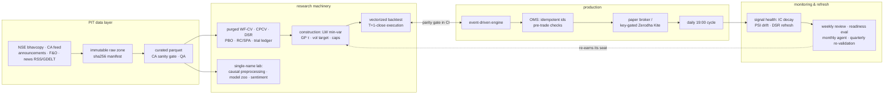

# Artha

[](https://github.com/vj0246/artha/actions/workflows/ci.yml)

A survivorship-free, research-to-production quant platform for NSE cash
equities — primary exchange data, Lopez de Prado-grade validation,
unattended daily paper operations, self-monitoring, and honest about
every number including the ones that got worse under scrutiny.

**Working paper: [Decomposition preprocessing is look-ahead](docs/research/PAPER_leaky_decomposition.md)
· Research report (Parts I + II): [docs/research/ARTHA_RESEARCH_REPORT.md](docs/research/ARTHA_RESEARCH_REPORT.md)
· New-maintainer handbook: [docs/HANDBOOK.md](docs/HANDBOOK.md)
· System overview: [docs/SYSTEM_OVERVIEW.md](docs/SYSTEM_OVERVIEW.md)**

## Headline results (net of full Indian costs)

| Portfolio | CAGR | Sharpe | MaxDD | Turnover |
|---|---|---|---|---|
| **LW min-var + GP τ0.5 (live config)** | 13.7% | **1.02** | −28% | 4.2× |
| Equal-weight + bands (P5 baseline) | 12.8% | 0.96 | −27% | 5.2× |
| Naive momentum 12-1 | 23.6% | 0.96 | −49% | — |
| NIFTY 500 (synthetic TRI) | 14.4% | 0.95 | −38% | — |

Family-level data-snooping tests: White Reality Check p = 0.012, Hansen
SPA p = 0.0415. Deflated Sharpe against the full 89-trial ledger:
**0.20** — economically attractive, statistically unproven, reported
exactly that way while the 30-session live-paper gate accumulates the
out-of-sample evidence.

## Findings a quant should actually read

- **Survivorship bias, measured**: the identical strategy on a
  survivor-only universe reports +2.5pp/yr CAGR that never existed.
- **Decomposition preprocessing is look-ahead** (single-name lab):
  EMD/CEEMDAN full-series preprocessing reproduces the literature's
  IC 0.41 / Sharpe 3.6 — and collapses to zero when re-decomposed
  causally each day. The leaky-minus-causal gap IS the published edge.
- **Published nulls, six of them**: cross-sectional ML vs factors
  (PBO 0.86); event features at weekly horizon (with inverted Indian
  PEAD, t = −6.9); regime gates beyond vol targeting; single-name model
  zoo vs buy-and-hold (incl. LSTM/transformer, either retrain window);
  sentiment gating (announcement sentiment: Sharpe 0.06 vs 0.58 floor);
  EWMA vs Ledoit-Wolf covariance.
- **A self-caught correction, kept in the record**: construction v2's
  first headline (Sharpe 1.119, maxDD −21%) was inflated by a
  position-cap bug acting as accidental de-risking; our own code review
  found it, the honest number is 1.018, and both figures stay in the
  report because the correction is the credential.
- **A validated upgrade candidate, held to the bar**: the momentum +
  low-vol rank blend scores Sharpe 1.30 vs 1.02 live — and stays
  unshipped until it passes the same CPCV/SPA/DSR battery that revised
  min-var's own headline downward.
- **Post-tax truth**: STCG turns 13.7% CAGR into 11.0% (Sharpe 1.02 →
  0.82) — computed before real money, because that's the number an
  account actually compounds.
- **Small-capital microstructure**: flat ₹15.34 DP charges + integer
  shares make ₹1L structurally unviable (38 bps/exit, 5.2% weight
  steps); minimum viable capital is measured at ₹2L, comfortable at ₹5L.
- **Data feeds lie**: the declared corporate-action feed contained 14
  phantom events (a fake 1:5 TVSMOTOR split manufactured a +398%
  return). The adjuster now verifies every declared factor against the
  ex-day price and persists rejections as QA artifacts.

## Architecture



## Production discipline

- Backtest/live **parity is a CI gate** (<2e-5/day); **zero-lookahead is
  a CI suite** (planted-jump caught a real bug); the sanity gates run
  both directions (prices vs declared CAs and back).
- **Unattended daily operation**: scheduled 19:00 cycle, idempotent end
  to end, one non-dry log row per session, `scheme_used` logged, kill
  switch + enforced drawdown rails, emergency flatten that bypasses its
  own pre-trade caps (tested with 85 positions).
- **Self-monitoring**: IC decay + feature-drift (PSI) alerts daily; DSR
  re-deflated against the live ledger; weekly live-vs-research replay
  (with proper risk-model warmup); monthly research-agent screens and
  quarterly re-validation, all ledgered.
- **Quantified go/no-go**: PSR, minimum track record length, Kupiec VaR
  exceptions, tracking error, capital sizing.

## Reproduce

```
uv sync
uv run pytest                      # 228 tests: unit, lookahead, parity
uv run python scripts/backfill_bhavcopy.py 2010-01-01 <today>
uv run python scripts/build_curated.py
uv run python scripts/run_baselines.py      # P2 factors
uv run python scripts/run_model_study.py    # P3 ML null
uv run python scripts/run_p5.py             # construction gate
uv run python scripts/run_construction_v2.py && uv run python scripts/run_spa.py
uv run python scripts/run_d2_preprocess.py  # the look-ahead exposure
uv run python scripts/run_dashboard.py      # http://127.0.0.1:8787
```

Full bootstrap (every backfill, study, and scheduled task):
[docs/HANDBOOK.md](docs/HANDBOOK.md). Data lives outside the repo
(`~/quant-data`, override `ARTHA_DATA_DIR`).

## Honest limitations

Synthetic TRI benchmark; static current-sector map; cash at 0%; hedge
margin financing unmodeled; paper slippage degenerate until live quotes;
DSR 0.20 vs the full ledger (conservative counting, but the direction is
the point); announcement taxonomy 81% accurate. Tracked in the plan's
verify-list with dates.
