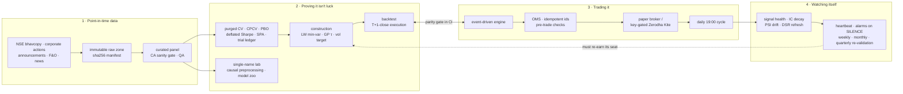

# Artha

[](https://github.com/vj0246/artha/actions/workflows/ci.yml)

**A systematic equity trading system for Indian markets — researched,
validated, and actually operated, on ₹0 of paid data.**

It runs by itself at 7pm every evening. It knows when it has been
fooled. And the most valuable thing it produced is a list of things
that *don't* work.

---

## Start here: what is this, really?

**If you've never traded:** imagine a machine that reads every price on
India's largest stock exchange each evening, decides which 25 companies
to hold, places the orders, checks its own books, and messages you if
anything looks wrong. Now imagine the harder part — proving the machine
is actually skilled rather than lucky, because financial data will hand
you a beautiful-looking answer that is completely false if you aren't
careful. Most of this project is the proving.

**If you trade:** point-in-time NSE panel from primary bhavcopy +
declared corporate actions (delistings included, CA feed verified
against ex-day prices in both directions), weekly cross-sectional
momentum, Ledoit-Wolf minimum-variance construction with
Gârleanu-Pedersen partial adjustment, vol targeting, ADV participation
caps, T+1-close execution, full Indian cost stack (STT, stamp,
exchange, GST, flat DP charges, sqrt impact). Validation is purged
walk-forward + CPCV, deflated Sharpe against an append-only trial
ledger, White Reality Check and Hansen SPA. The live layer has
backtest/engine parity as a CI gate, deterministic idempotent order
ids, enforced drawdown rails, and a heartbeat that alarms on silence.

**One line:** a research lab that happens to trade, built so its own
results can't lie to it.

---

## The results

Net of the complete Indian cost stack, 2012–2026:

| Portfolio | CAGR | Sharpe | MaxDD | Turnover |
|---|---|---|---|---|
| **LW min-var + GP τ0.5 — the live config** | 13.7% | **1.02** | −28% | 4.2× |
| Equal-weight + no-trade bands (previous) | 12.8% | 0.96 | −27% | 5.2× |
| Naive momentum 12-1 | 23.6% | 0.96 | −49% | — |
| NIFTY 500 (synthetic TRI) | 14.97% | 0.94 | −38% | — |

**Read that table the way the project does:** the live book earns *less
raw return* than the index (13.7% vs 14.97%) at *lower volatility* —
which is why its Sharpe is higher. It is a risk-adjusted win, not a
return win. After Indian short-term capital-gains tax the CAGR is
11.0%. And deflated against all ~100 experiments in the trial ledger,
the significance of that Sharpe is **0.20** — economically attractive,
statistically unproven, and stated exactly that way everywhere here.

That last number is the point. Most projects report the best figure
they found. This one reports the figure that survives being counted.

---

## Seven things that didn't work (the actual contribution)

Nulls are the expensive, useful output of research. These are ours:

1. **Machine learning doesn't beat momentum.** Ridge, LightGBM, MLP and
   a transformer under one purged protocol. PBO 0.86 — the in-sample
   winner is overfit 24 times out of 28 splits.
2. **Post-earnings drift runs *backwards* in India.** 1.48M timestamped
   exchange announcements; the biggest positive surprises **reverse**
   (t = −6.9). Event features add no weekly alpha.
3. **Momentum-crash regime gates add nothing** beyond the volatility
   targeting already shipped.
4. **The single-name model zoo loses to buy-and-hold.** GRU, LSTM,
   transformer, ensemble — all under half the always-long floor after
   costs, under both retraining schemes. Retraining cadence turned out
   irrelevant: the problem is absence of signal, not staleness.
5. **News sentiment gating subtracts value** (0.06 vs 0.58 Sharpe),
   consistent with the inverted drift in #2.
6. **EWMA covariance doesn't beat Ledoit-Wolf** — faster adaptation,
   paid for in churn.
7. **A learned trading-speed policy ties the fixed constant.** LinUCB
   over 728 weekly decisions: PBO 0.93 and near-uniform action counts —
   the agent itself reporting that the objective surface is flat and
   Gârleanu-Pedersen's constant is already near-optimal.

**And the headline finding, written up as a working paper:**
[decomposition preprocessing is look-ahead](docs/research/PAPER_leaky_decomposition.md).
A large literature reports Sharpe 3+ on daily equity forecasting after
EMD/CEEMDAN preprocessing. We reproduced those numbers *exactly* — IC
0.41, Sharpe 3.6 — then recomputed the identical transform causally, so
no future data could touch any training input. **The entire edge
vanished** (IC −0.04). The leaky-minus-causal gap *is* the published
result — which is what a global transform applied before a temporal
split does to you.

---

## Things that went wrong, and were fixed in public

A research system's credibility is how it behaves when it's wrong.

- **The data feed lied.** The declared corporate-action feed carried a
  1:5 TVSMOTOR split that never happened, manufacturing a +398% phantom
  return. The adjuster now verifies every declared factor against the
  ex-day price and rejects contradictions — it caught **14** phantom
  events across the history.
- **We caught ourselves inflating a headline.** Construction v2 first
  measured Sharpe 1.119 with a −21% drawdown. Our own code review found
  a position-cap bug silently parking gross in cash — accidental
  de-risking. Corrected to **1.018**. Both numbers stay in the record.
- **We corrected our own significance claim.** "The family beats the
  index (SPA p = 0.0415)" turned out to be carried by a naive
  fully-invested baseline inside that family; across constructed
  configurations alone, p = 0.655. The claim is now stated precisely.
- **A promising upgrade was refused.** A momentum + low-vol blend scored
  Sharpe 1.30 against the live 1.02, then failed two of four
  pre-registered gates (PBO 0.500, SPA 0.655). It was **held, not
  shipped** — and the friendlier re-test that might have rescued it was
  deliberately not run.

---

## How it runs itself



**Five scheduled jobs, all registered:** trade at 19:00; heartbeat at
21:00 asking *did any of that actually happen?*; a weekly
live-vs-research divergence check; monthly research-agent screens;
quarterly re-validation of the shipped configuration.

**The alarm philosophy:** an alert nobody receives isn't an alert. Every
alarm is written durably to disk before any push channel is attempted,
and the loudest failure mode — **silence**, a cycle that never ran — has
its own dedicated watchdog. Nothing auto-remediates: alarms inform,
humans decide.

**A research agent that learns.** It proposes new features, runs them
through an AST-sandboxed DSL (model output is never executed unaudited),
screens them under the standard protocol, and keeps a Thompson-sampling
posterior over which *families* of idea have historically paid off,
rebuilt from the ledger's own history. It has demonstrably changed its
mind: after two negative liquidity screens it reordered what it tries
next. Knowledge compounds; risk doesn't, because it never touches the
live book.

---

## Run it yourself

```bash
uv sync
uv run pytest                               # 243 tests: unit, lookahead, parity

# rebuild the world from primary sources (hours, all resumable)
uv run python scripts/backfill_bhavcopy.py 2010-01-01 <today>
uv run python scripts/build_curated.py

# reproduce the findings
uv run python scripts/run_baselines.py      # factor baselines
uv run python scripts/run_model_study.py    # the ML null
uv run python scripts/run_d2_preprocess.py  # the look-ahead exposure
uv run python scripts/run_construction_v2.py && uv run python scripts/run_spa.py
uv run python scripts/run_h1_rl_control.py  # the RL control null

# operate it
uv run python scripts/run_dashboard.py      # http://127.0.0.1:8787
uv run python scripts/run_heartbeat.py      # ops health
```

| Document | What it's for |
|---|---|
| [HANDBOOK](docs/HANDBOOK.md) | Every folder, file and decision; from-scratch setup; the gotchas that cost real time |
| [SYSTEM_OVERVIEW](docs/SYSTEM_OVERVIEW.md) | The condensed map |
| [RESEARCH REPORT](docs/research/ARTHA_RESEARCH_REPORT.md) | The full study, Parts I & II |
| [WORKING PAPER](docs/research/PAPER_leaky_decomposition.md) | The look-ahead finding |
| [RUNBOOK](docs/RUNBOOK.md) | Daily operations, alarms, kill switch |
| [PROJECT_PLAN](docs/PROJECT_PLAN.md) | Authoritative plan + full execution history |
| [decisions/](docs/decisions/) | 13 ADRs — every irreversible choice, with its evidence |

The HANDBOOK is written so a stranger can carry this project forward
with no verbal handover.

The ops dashboard is **localhost-only by design**: it shows live
positions, equity and operational state with no authentication, so it is
not deployed anywhere
([ADR 0012](docs/decisions/0012-track-g-ops-hygiene.md)).

---

## Honest limitations

Synthetic TRI benchmark (no free NIFTY 500 TRI exists); static
current-sector map; cash earns 0%; hedge margin financing unmodelled;
paper slippage degenerate until live quotes arrive; announcement
taxonomy 81% accurate (audited); GDELT news coverage reached 72 of 115
months before the free API rate-limited us; and DSR 0.20 counts every
single-name experiment against the cross-sectional book, which is
conservative — but the direction is the point.

Every one is tracked with a confirmation date in the plan's verify-list.
Nothing here is hidden, because a limitation you disclose can't ambush
you later.
