# Artha

[](https://github.com/vj0246/artha/actions/workflows/ci.yml)

A survivorship-free, research-to-production quant platform for NSE cash
equities — built from primary exchange sources, validated with Lopez de
Prado-grade statistics, running live paper operations daily, and honest
about what did not work.

**Full study: [docs/research/ARTHA_RESEARCH_REPORT.md](docs/research/ARTHA_RESEARCH_REPORT.md)
· New-maintainer handbook: [docs/HANDBOOK.md](docs/HANDBOOK.md)
· Live-ops plan: [docs/TRACK_B_PLAN.md](docs/TRACK_B_PLAN.md)**

## Headline results (net of full Indian costs, 2012-2026)

| Portfolio | CAGR | Vol | Sharpe | MaxDD |
|---|---|---|---|---|
| **Constructed momentum (shipped)** | 12.9% | 13.5% | **0.97** | **−27%** |
| Naive momentum 12-1 | 23.6% | 25.6% | 0.96 | −49% |
| NIFTY 500 (synthetic TRI) | 14.4% | 16.0% | 0.95 | −38% |
| Shipped + NIFTY futures hedge (2021-26) | 7.1% | 11.0% | 0.68 | −14% |

Construction (caps, bands, ADV participation, vol targeting) holds Sharpe
while **halving the drawdown**. The futures hedge strips beta 0.58 to a
residual −0.02 — reported honestly as a **risk dial, not a free lunch**
(the beta carried real return; hedge drag 36 bps/yr).

## Findings a recruiter should actually read

- **Survivorship bias, measured not assumed**: the identical strategy on a
  survivor-only universe reports **+2.5pp/yr CAGR that never existed**
  (23% of names — the delisted losers — vanish from a current-constituents
  dataset).
- **ML vs simple factors — published null**: ridge / LightGBM / MLP /
  transformer under one purged walk-forward + CPCV protocol. Best ML
  (ridge, IC 0.043) nets Sharpe 0.84 — **nothing beats momentum 0.96 /
  low-vol 1.08 net of costs**. PBO = 0.86: the in-sample winner is overfit
  24 times out of 28 combinatorial splits.
- **Inverted PEAD in India — published null**: 1.48M exchange
  announcements with receipt timestamps (58.5% land after the close — a
  knowability rule enforces this). Big positive surprises **reverse**
  (t = −6.9); event features add no incremental weekly alpha.
- **Every trial counted**: an append-only ledger feeds the deflated Sharpe
  (DSR 0.64 vs a 25-trial ledger) — economically strong, below the 95%
  statistical bar, and reported exactly that way. An autonomous research
  agent that proposes features through an AST-sandboxed DSL appends its
  screens to the same ledger, so multiple-testing honesty survives
  automation.
- **Small-capital microstructure**: flat DP charges (₹15.34/scrip/day on
  sells) and integer shares make ₹1L structurally unviable (38 bps per
  exit, 5.2% weight granularity, Sharpe 1.03 vs 1.15 at ₹5L). Minimum
  viable capital is measured, not guessed.

## Architecture

```mermaid
flowchart LR
  subgraph DATA["PIT data layer"]
    A[NSE bhavcopy<br/>dual format] --> C[immutable raw zone<br/>sha256 manifest]
    B[declared CA feed<br/>+ announcements + F&O] --> C
    C --> D[curated parquet<br/>adjusted, QA-gated]
  end
  subgraph RESEARCH["research (Track A)"]
    D --> E[feature library +<br/>PIT universe]
    E --> F[purged WF-CV / CPCV<br/>DSR · PBO · trial ledger]
    F --> G[construction: caps, bands,<br/>ADV, vol targeting]
    G --> H[vectorized backtest<br/>T+1-close execution]
  end
  subgraph LIVE["production (Track B)"]
    H <-- parity gate in CI --> I[event-driven engine<br/>T+1 settlement, halts, bands]
    I --> J[OMS: idempotent ids,<br/>pre-trade checks]
    J --> K[paper broker /<br/>key-gated Zerodha Kite]
    K --> L[daily 19:00 cycle:<br/>backfill → rebuild → trade → reconcile]
    L --> M[kill switch · drawdown rails<br/>readiness eval · dashboard]
  end
```



## Production discipline

- **Backtest/live parity is a CI gate**: the vectorized loop and the
  event-driven engine agree to <2e-5/day on fractional shares; integer
  differences are bounded by rounding.
- **Zero-lookahead is a CI suite**, not a claim: planted-jump and
  scrambled-signal tests (the planted jump caught a real
  execution-ordering bug).
- **Daily unattended operation** (Windows scheduled task): incremental
  backfill → curated rebuild → integrity scan → paper trading → reconcile
  → Telegram alert. Idempotent end to end — deterministic order ids make
  a crashed rerun unable to double-trade.
- **Enforced risk rails**: −10% from peak halves gross, −15% freezes; the
  emergency flatten bypasses pre-trade caps by design; kill-switch drill
  executed and logged.
- **Go/no-go is quantified** (`scripts/run_live_readiness.py`):
  Probabilistic Sharpe Ratio, minimum track record length, Kupiec VaR
  exception test, live-vs-research tracking error, and capital sizing —
  the report says exactly what a short live sample can and cannot prove.
- **Read-only ops dashboard** (FastAPI + dependency-free page): equity
  and benchmark charts, go-live checklist, sizing study, trial ledger.

## Reproduce

```
uv sync
uv run pytest                      # 201 tests: unit, lookahead, parity
uv run python scripts/backfill_bhavcopy.py 2010-01-01 2026-07-18
uv run python scripts/build_curated.py
uv run python scripts/run_baselines.py
uv run python scripts/run_model_study.py
uv run python scripts/run_p5.py
uv run python scripts/run_survivorship_demo.py
uv run python scripts/run_hedge_study.py
uv run python scripts/run_dashboard.py     # http://127.0.0.1:8787
```

Data lands outside the repo (`~/quant-data`, override `ARTHA_DATA_DIR`).
GPU legs use CUDA torch (`uv pip install torch --index-url
https://download.pytorch.org/whl/cu126 --reinstall`, then `uv run
--no-sync`).

## Honest limitations

Synthetic TRI benchmark (no scriptable NIFTY 500 TRI source); static
current-sector map; cash at 0%; rights/special dividends unadjusted
(QA-flagged); hedge margin financing not modeled; announcement taxonomy
81% accurate (audited); paper slippage degenerate until live quotes
(close-fill by construction). Every limitation is tracked in the plan's
verify-list with confirmation dates.
